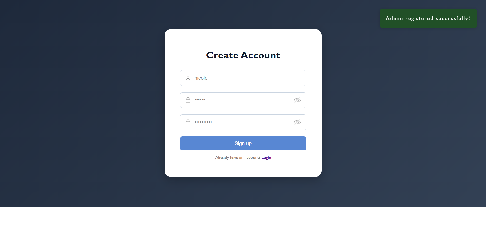
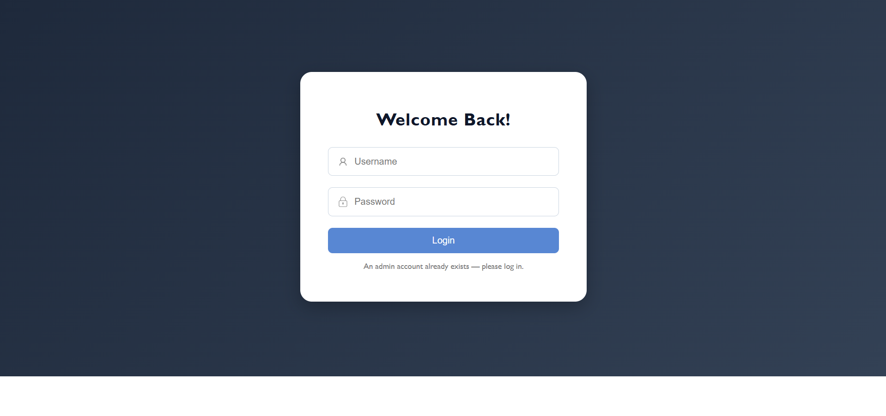
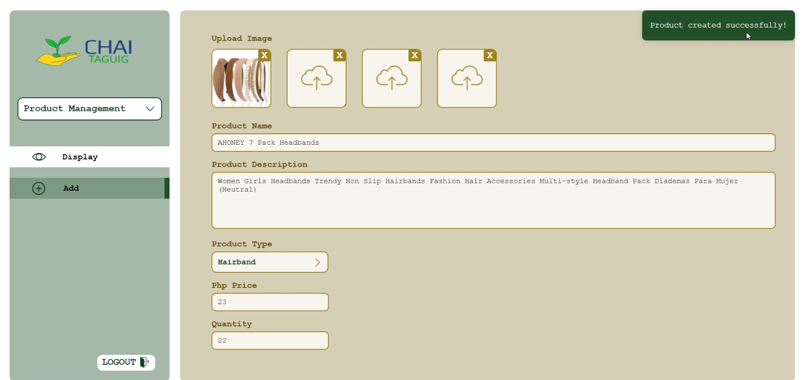
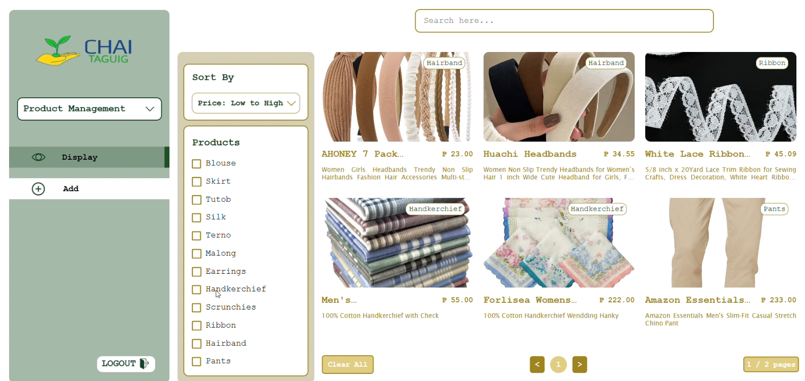
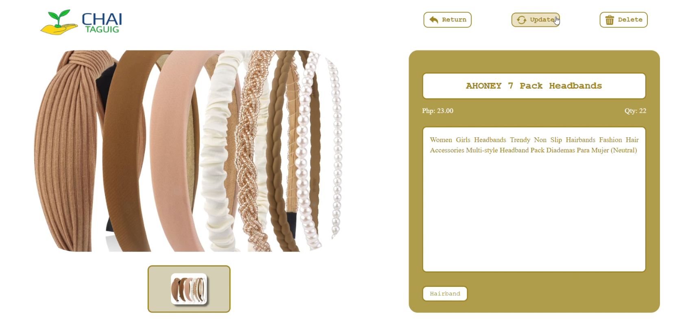
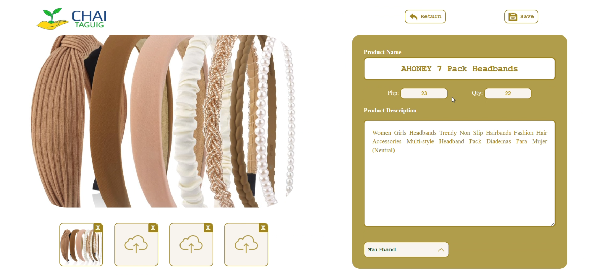

# 🌿 Likhang Maharlika Inventory System


A full-stack web module built for **Community Hope Alternative, Inc. (CHAI) – Taguig**, a Philippine non-profit organization that supports Filipino families through education, livelihood, and feeding programs. 

## About This Repository

This repository showcases the **Admin Authentication** and **Likhang Maharlika Inventory Management** modules of the CHAI-Taguig admin panel, the components I personally designed and developed as part of a larger group project.

Likhang Maharlika is CHAI-Taguig's livelihood program, selling handcrafted Muslim garments and accessories such as hijabs, ternos, and traditional attire. Previously, the organization tracked product stock using handwritten lists and spreadsheets, with no reliable way to generate reports or prevent data entry errors. This module replaces that manual process with a secure, web-based inventory system.

> **Scope note:** This was originally built as part of a larger group system (which also includes a public website, membership management, and sales tracking, developed by teammates). This repository documents only the authentication and inventory features I built.

## Features

**Admin Authentication**
- Admin registration with single-admin enforcement (blocks duplicate admin sign-ups)
- Login with input validation and error handling
- Toggleable password visibility on sign up

**Inventory Management (Likhang Maharlika)**
- Add new products with up to 4 images, name, description, category, price, and quantity
- Browse the full product catalog with search, category filters, and sort-by-price
- View individual product details
- Update existing product information
- Delete products
- Paginated results for large catalogs

## Screenshots

### Authentication

| Login | Sign Up | Duplicate Admin Handling |
|---|---|---|
|  |  |  |

### Inventory Management

| Add Product |
|---|
|  |

| Product Catalog |
|---|
|  |

| Product Details | Edit Product |
|---|---|
|  |  |

## 🛠️ Tech Stack

| Layer | Technology |
|---|---|
| Frontend | React.js |
| Backend | Node.js, Express.js |
| Dev logging | Morgan |
| Database | MongoDB |


## Getting Started

### Prerequisites
- [Node.js](https://nodejs.org/) and npm installed

### Installation

```bash
npm install
```

### Running the frontend

```bash
npm start
```

### Running the backend

```bash
npm run dev    # development mode (with Morgan request logging)
npm start      # production mode
```

## Project Background

Built for the CSSWENG course at De La Salle University, in partnership with **Community Hope Alternative, Inc. (CHAI) – Taguig**. The full project delivers CHAI-Taguig a public-facing website and an internal admin panel to help the organization manage its Batang Gift of Love membership, Gift Global and Batang Gift of Love event postings, and Likhang Maharlika's product inventory and sales; replacing what were previously manual, spreadsheet- and social-media-based processes.

## 🙏 Acknowledgments

- **Community Hope Alternative, Inc. (CHAI) – Taguig** for the partnership and project opportunity
- My teammates for collaborating on the broader system this module belongs to
